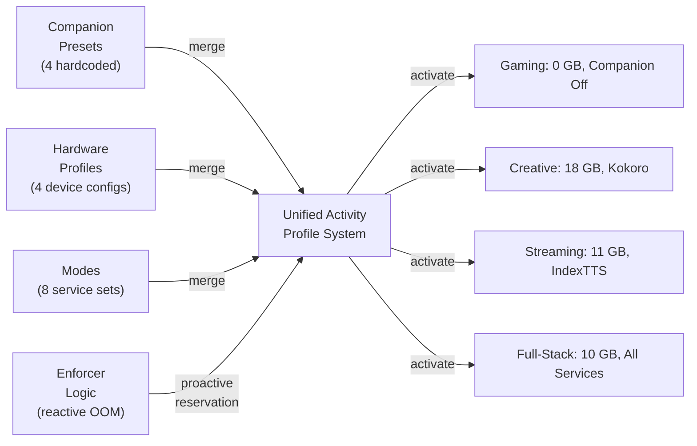
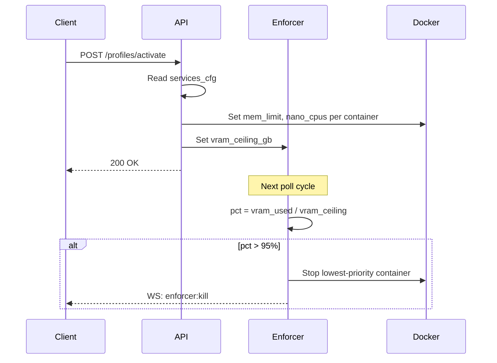
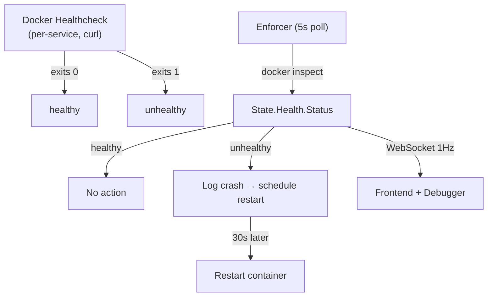
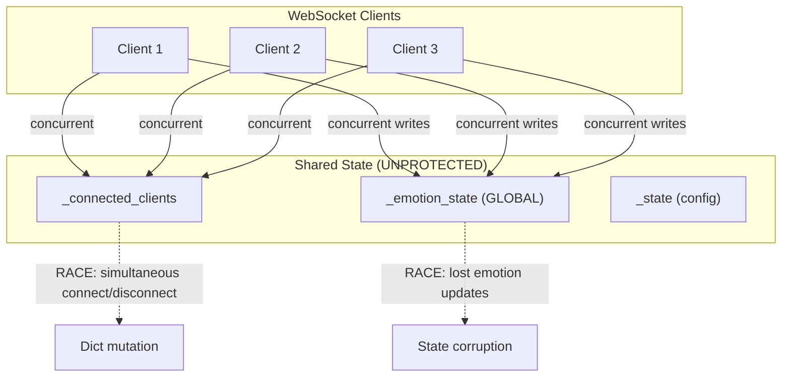
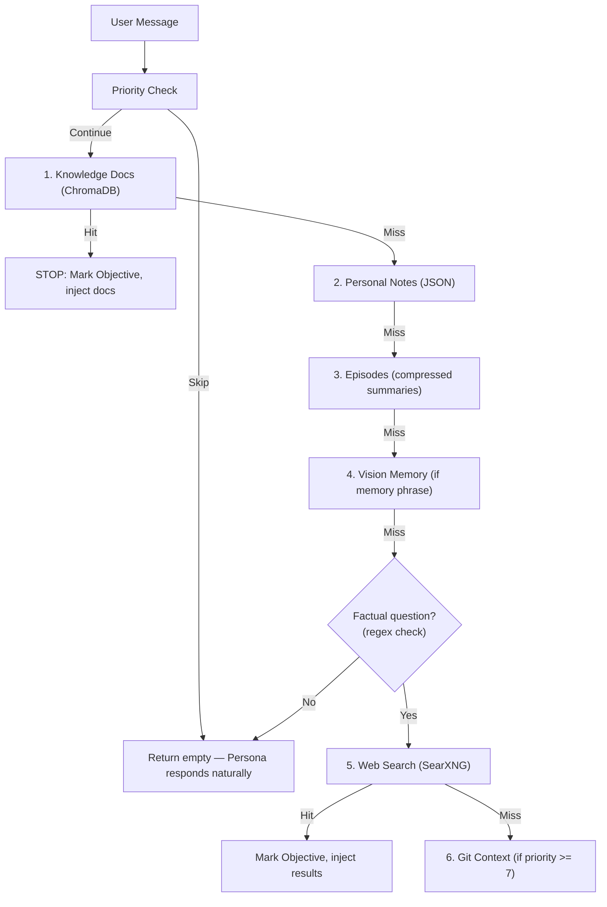
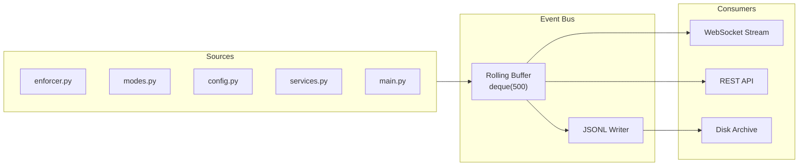
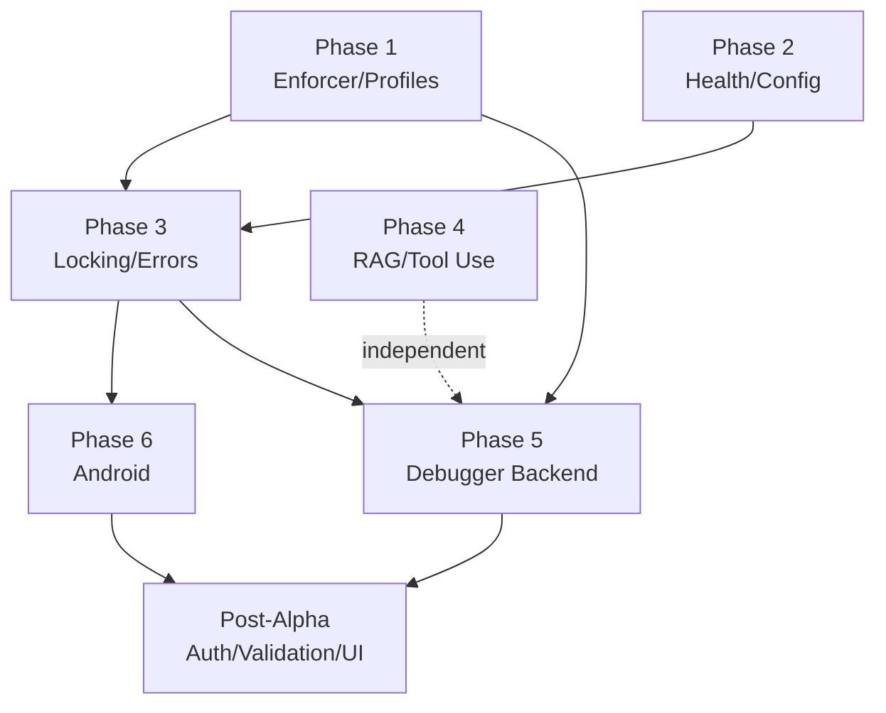

# Origin Ignition Prompt — Path to Alpha 1.0

> **oAIo is the brain. oprojecto is the body. Android is the reach.**
>
> This document is the complete technical blueprint for completing the oAIo Alpha 1.0 cycle.
> Every phase, every file, every decision — sequenced, mapped, and ready to execute.
>
> Generated: 2026-03-21 | System: SYS-PANDORA-OAO

---

## Table of Contents

1. [Context, Vision & System Architecture](#context-vision--system-architecture)
2. [Phase 1A — Unified Profile System](#phase-1a--unified-profile-system)
3. [Phase 1B–1D — Enforcement, Symlink Bus, Recovery](#phase-1b--profile-aware-enforcement)
4. [Phase 2A — Health Checks on All 14 Services](#phase-2a--health-checks-on-all-14-services)
5. [Phase 2B — Config Consistency Fixes](#phase-2b--config-consistency-fixes)
6. [Phase 2C — Single Source of Truth for Defaults](#phase-2c--single-source-of-truth-for-defaults)
7. [Phase 3 — Robustness: Locking & Error Handling](#phase-3--robustness-locking--error-handling)
8. [Phase 4 — RAG Pipeline: LLM as Router](#phase-4--rag-pipeline-llm-as-router)
9. [Phase 5 — Debugger: The Nervous System](#phase-5--debugger-the-nervous-system)
10. [Phase 6 — Android: Remote Body, Same Brain](#phase-6--android--remote-body-same-brain)
11. [Post-Alpha / Finalization](#post-alpha--finalization)
12. [Dependency Graph & Execution Priority](#dependency-graph)
13. [Verification Checklist](#verification-checklist-alpha-complete)

---

## Principles

- **One source of truth per concern**
- **The LLM decides, not regex**
- **The enforcer controls resources, everything else reads from it**
- **The symlink bus is the nervous system** — every data path flows through it
- **The debugger connects all subsystems into one observable whole**
- **Desktop is the primary body, Android is the remote body, same brain**
- **Frontend-agnostic**: every backend system exposes clean REST/WebSocket APIs — any frontend (hub, mobile, third-party) can plug in without backend changes

---

## Context, Vision & System Architecture

### What It Is

**oAIo** is a local AI workstation orchestration platform — not a single AI tool, but the infrastructure layer that makes 13+ Docker containers aware of each other, enforces shared GPU/VRAM constraints, and presents them as one coherent system. It is **OctoPrint for AI infrastructure**: a control plane that manages resource contention, service lifecycles, storage tiers, and multi-client relay protocols.

**oprojecto** is a Godot 4.6 desktop AI companion client — a transparent overlay application with a VRM 3D avatar that connects to oAIo via WebSocket. It renders animations, handles voice I/O, manages screen awareness, and provides a natural desktop presence for the AI persona.

**The connection model**: oprojecto is the **body**, oAIo is the **brain**. One system, not two projects. They communicate via a WebSocket relay (`/extensions/companion/ws`), where oprojecto streams user voice/vision/chat inputs upstream, and oAIo routes them through the full RAG + emotion + TTS pipeline, sending back audio and state updates. When oAIo goes down, oprojecto falls back to direct HTTP connections to individual services.

---

### System Overview Diagram

```
┌────────────────────────────────────────────────────────────────────────────┐
│                    HOST MACHINE (Ryzen 9 3900X, 62GB RAM, RX 7900 XT)      │
│                                                                             │
│  ┌──────────────────────────────────────────────────────────────────────┐  │
│  │                        Docker Compose Network (oaio-net)              │  │
│  │                                                                       │  │
│  │  ┌────────────────┐  ┌────────────────┐  ┌────────────────┐         │  │
│  │  │ Ollama         │  │ Kokoro TTS     │  │ RVC Proxy      │         │  │
│  │  │ :11434         │  │ :8000          │  │ :8001 :7865    │         │  │
│  │  │ (LLM)          │  │ (Voice Synth)  │  │ (Voice Conv)   │         │  │
│  │  └────────────────┘  └────────────────┘  └────────────────┘         │  │
│  │                                                                       │  │
│  │  ┌────────────────┐  ┌────────────────┐  ┌────────────────┐         │  │
│  │  │ F5-TTS         │  │ StyleTTS2      │  │ ComfyUI        │         │  │
│  │  │ :7860          │  │ :7870          │  │ :8188          │         │  │
│  │  │ (Clone Voice)  │  │ (Prototype)    │  │ (Image Gen)    │         │  │
│  │  └────────────────┘  └────────────────┘  └────────────────┘         │  │
│  │                                                                       │  │
│  │  ┌────────────────┐  ┌────────────────┐  ┌────────────────┐         │  │
│  │  │ MoMask         │  │ Florence-2     │  │ Faster-Whisper │         │  │
│  │  │ :8005          │  │ :8010          │  │ :8003 :7880    │         │  │
│  │  │ (Motion Gen)   │  │ (Vision)       │  │ (STT)          │         │  │
│  │  └────────────────┘  └────────────────┘  └────────────────┘         │  │
│  │                                                                       │  │
│  │  ┌────────────────────────────────────────────────────────────┐     │  │
│  │  │               oAIo Control Plane :9000 :8002               │     │  │
│  │  │  ┌──────────────────────────────────────────────────────┐  │     │  │
│  │  │  │  Backend (FastAPI)                                    │  │     │  │
│  │  │  │  ├─ ollmo/main.py       (oLLMo API orchestration)    │  │     │  │
│  │  │  │  ├─ oaudio/main.py      (Voice pipeline routing)     │  │     │  │
│  │  │  │  ├─ core/enforcer.py    (VRAM enforcement loop)      │  │     │  │
│  │  │  │  ├─ core/docker_control.py (Service lifecycle)       │  │     │  │
│  │  │  │  └─ extensions/companion/ (Persona + RAG relay)      │  │     │  │
│  │  │  │                                                       │  │     │  │
│  │  │  │  1Hz WebSocket Stream (VRAM, GPU%, services)         │  │     │  │
│  │  │  └──────────────────────────────────────────────────────┘  │     │  │
│  │  │  ┌──────────────────────────────────────────────────────┐  │     │  │
│  │  │  │  Frontend (browser UI, LiteGraph node editor)         │  │     │  │
│  │  │  └──────────────────────────────────────────────────────┘  │     │  │
│  │  └────────────────────────────────────────────────────────────┘     │  │
│  │                                                                       │  │
│  │  ┌────────────────┐  ┌────────────────┐  ┌────────────────┐         │  │
│  │  │ Open-WebUI     │  │ SearXNG        │  │ Letta          │         │  │
│  │  │ :3000          │  │ :8888          │  │ :8283          │         │  │
│  │  │ (Chat UI+RAG)  │  │ (Web Search)   │  │ (Multi-agent)  │         │  │
│  │  └────────────────┘  └────────────────┘  └────────────────┘         │  │
│  │                                                                       │  │
│  └──────────────────────────────────────────────────────────────────────┘  │
│                                                                             │
│                    /mnt/oaio/* (Symlink Bus — all volumes)                  │
│                                                                             │
│  ┌──────────────────────────────────────────────────────────────────────┐  │
│  │                  oprojecto (Godot 4.6 Desktop Client)                │  │
│  │  ┌────────────────────────────────────────────────────────────────┐  │  │
│  │  │  WebSocket: /extensions/companion/ws (port 9000)               │  │  │
│  │  │  Fallback: Direct HTTP (ollama:11434, kokoro:8000, etc)        │  │  │
│  │  │                                                                 │  │  │
│  │  │  VRM Avatar Renderer | Voice Pipeline (F2 PTT, lip sync)      │  │  │
│  │  │  Engagement Modes | Desktop Physics | Screen Awareness         │  │  │
│  │  │  F3 Toolbar (8 sections) | Chat Panel | 87 VRMA Animations    │  │  │
│  │  └────────────────────────────────────────────────────────────────┘  │  │
│  │  Transparent Overlay | 3440x1440 ultrawide | KDE Plasma X11         │  │
│  └──────────────────────────────────────────────────────────────────────┘  │
└────────────────────────────────────────────────────────────────────────────┘
```

---

### Storage Layout

```
Physical Hardware                Symlink Bus                    Runtime Tiers
────────────────────────────────────────────────────────────────────────────

NVMe (nvme0n1)                  /mnt/oaio/
596GB + 319GB               ┌───────────────────────────┐
├─ / (OS, Steam, home)      │ ollama ─────────→ m.2 SATA │
├─ /mnt/storage (staging)   │ models ─────────→ NVMe     │
└─ Active model cache       │ staging ────────→ NVMe     │
                             │ kokoro-voices ──→ m.2 SATA │
m.2 SATA (sda1)             │ comfyui-user ───→ m.2 SATA │
220GB, SATA III on M.2      │ hf-cache ───────→ m.2 SATA │
├─ oAIo project             │ rvc-weights ────→ m.2 SATA │
├─ ollama models             │ rvc-ref ────────→ NVMe     │
├─ oaio-hub data             │ ref-audio ──────→ m.2 SATA │
└─ Persistent storage        │ outputs ────────→ m.2 SATA │
                             │ momask-models ──→ m.2 SATA │
Motherboard SATA             │ (+ 12 more)                │
(bulk, lower throughput)     └───────────────────────────┘
                                        │
RAM (/dev/shm)                          │ RAM TIER (dynamic)
Up to 46 GB ceiling           oaio-ollama ──→ /dev/shm
├─ On-demand activation       oaio-models ──→ /dev/shm
└─ Auto-reverts on crash      (recover_dangling on boot)
```

---

### Service Map

| Service | Port | Image | Purpose | VRAM Est | Priority | Limit |
|---------|------|-------|---------|----------|----------|-------|
| **ollama** | 11434 | ollama:rocm | LLM inference (ROCm) | 7.5 GB | 5 | hard |
| **open-webui** | 3000 | ghcr.io/open-webui | Chat UI + ChromaDB RAG | 1.3 GB RAM | 30 | hard |
| **kokoro-tts** | 8000 | local build | Voice synthesis (streaming) | 0.8 GB RAM | 10 | hard |
| **rvc** | 8001/7865 | local build | Voice conversion proxy | 2.1 GB | 10 | hard |
| **f5-tts** | 7860 | local build | Voice cloning (ref audio) | 3.2 GB | 5 | hard |
| **styletts2** | 7870 | local build | Voice prototyping | 1.8 GB | 4 | hard |
| **comfyui** | 8188 | local build | Image generation (Flux.1) | 12 GB | 3 | hard |
| **faster-whisper** | 8003/7880 | local build | Speech-to-text (CPU) | CPU only | — | hard |
| **momask** | 8005 | local build | Text-to-motion gen | 2.8 GB | — | hard |
| **florence-2** | 8010 | local build | Vision model | 1.5 GB | — | soft |
| **indextts** | 8004/7890 | local build | Voice cloning (alt) | 2.1 GB | — | hard |
| **searxng** | 8888 | searxng:latest | Privacy web search | minimal | — | soft |
| **letta** | 8283 | letta:latest | Multi-agent framework | 0.5 GB | — | soft |
| **oaio** | 9000/8002 | local build | Control plane + voice API | 2.0 GB | — | — |

---

### Extension System

| Extension | LoC | Purpose | Status |
|-----------|-----|---------|--------|
| **companion** | 3,331 | Persona engine (Kira), WebSocket relay, RAG waterfall, emotion detection, TTS routing | Primary |
| **fleet** | 735 | Multi-node orchestration + node registration | Enabled |
| **m3** | 686 | Multi-model management | Enabled |
| **debugger** | 136 | Container log streaming (stub) | Enabled |
| **example** | 20 | Template for new extensions | Disabled |

**Companion modules:** backend.py (1,886), persona.py (493), rag.py (306), tools.py (138), episodes.py (71), notes.py (79), knowledge.py (175), vision_memory.py (63), webui/kira_filter.py (120)

---

### WebSocket Protocol

```
CLIENT → SERVER:
  chat.request   {text, history[], context}
  stt.audio      {audio_b64, format, sample_rate, auto_chat, history[]}
  vision.analyze {image_b64, context, prompt, model}
  state.sync     {client_type, platform, name, capabilities[]}
  ping

SERVER → CLIENT:
  chat.response  {text, done, emotion{primary, intensity, secondary}, objective}
  tts.audio      {data: base64_mp3, format}
  stt.transcript {text, confidence}
  state.sync     {services{}, active_modes[], enforcement_status}
  config.sync    {updated_keys{}}
  pong
```

---

### Current State

**Working:** LLM chat, voice I/O (Kokoro + RVC), 14 emotions (face + body), F2 PTT, screen awareness, desktop physics, F3 toolbar, RAG waterfall, Persona Matrix, enforcement loop, symlink bus, 87 animations

**Broken/Isolated:** oAudio /convert + /clone untested, MoMask build incomplete, F5-TTS host RAM pressure, mobile client not exported, boot_with_system not respected, graph data router incomplete, Fleet + M3 stubbed

---

## Phase 1A — Unified Profile System

### Current State: Fragmented Profile Architecture

The system currently has **four separate, disconnected profile/preset layers** that all try to solve the same problem — adapting compute allocation to different usage contexts — but fail to coordinate:

1. **Companion Extension Presets** (`extensions/companion/backend.py`, lines 1115-1148) — 4 hardcoded resource presets controlling TTS engine, vision model, ollama model selection. Only affects companion behavior.

2. **Hardware Profiles** (`config/profiles.json`) — 4 device profiles (Jetson Nano, youyeetoo X1, RPi5, mini-pc) controlling VRAM ceiling, RAM limit, CPU cores, I/O bandwidth. Affects enforcer and Docker limits.

3. **Modes System** (`config/modes.json`, 8 modes) — Service orchestration: which containers run together. No awareness of companion settings or hardware profiles.

4. **Enforcer Logic** (`backend/core/enforcer.py`) — Reactive OOM management: kills low-priority containers on VRAM pressure. Separate thresholds (WARN 85%, HARD 95%). No proactive profile-based resource reservation.

**The Problem:** A user context shift (e.g., "switch to gaming") requires manual changes across all four layers, and these layers do not coordinate.

---

### Current Companion Presets

| Preset | TTS Engine | Vision | Vision Model | Ollama Models | VRAM Est |
|--------|-----------|--------|--------------|---------------|----------|
| `max_quality` | indextts | true | llava:7b | qwen2.5:7b, llava:7b | ~10 GB |
| `optimal` | kokoro | true | llava:7b | qwen2.5:7b, llava:7b | ~6 GB |
| `lite` | kokoro | false | — | qwen2.5:7b | ~3 GB |
| `gaming` | off | false | — | — | 0 GB |

---

### Proposed Activity Profiles

| Activity | Use Case | TTS | Vision | RAG | Enforcer Ceiling | Notes |
|----------|----------|-----|--------|-----|------------------|-------|
| **gaming** | Max GPU for games | off | off | off | 0 GB | Companion sleeps, enforcer disabled |
| **creative** | GPU for Houdini/Unreal | kokoro | true | on | 18 GB | Full creativity + companion guidance |
| **streaming** | Gaming + OBS + Kira | indextts | true | light | 11 GB | High-quality voice for audience |
| **full-stack** | Dev + AI tools + vision | indextts | true | full | 10 GB | All services, heavy RAG |

---

### Unified Profile Schema

```json
{
  "id": "gaming",
  "name": "Gaming",
  "category": "activity",
  "companion": {
    "enabled": false,
    "tts_engine": "off",
    "vision_enabled": false,
    "ollama_model": null
  },
  "mode": {
    "name": null,
    "services": [],
    "vram_budget_gb": 0
  },
  "rag": {
    "enabled": false,
    "web_search_enabled": false,
    "knowledge_enabled": false
  },
  "enforcer": {
    "enabled": false,
    "vram_ceiling_gb": 0,
    "warn_threshold": 0.85,
    "hard_threshold": 0.95
  }
}
```

---

### Migration Diagram



---

### Code Deletion & Refactoring

| Action | File | What |
|--------|------|------|
| **DELETE** | `extensions/companion/backend.py` | `_PRESETS` dict (lines 1115–1148), `/presets` endpoints |
| **DELETE** | `config/profiles.json` | Replaced by activity profiles |
| **REFACTOR** | `backend/api/modes.py` | Modes activated only via profile, not directly |
| **REFACTOR** | `backend/api/shared.py` | `apply_profile()` → handle services + ollama + companion |
| **REFACTOR** | `backend/core/enforcer.py` | Read active profile, proactive limits |
| **REFACTOR** | `backend/core/resources.py` | Read ceilings from enforcer |
| **NEW** | `backend/api/profiles.py` | Activity profile CRUD + activation |
| **NEW** | `config/activity_profiles.json` | 4 default profiles |

---

### New API Endpoints

| Method | Path | Purpose |
|--------|------|---------|
| GET | `/activity-profiles` | List all profiles |
| GET | `/activity-profiles/{id}` | Get single profile |
| POST | `/activity-profiles` | Create custom profile |
| **POST** | **`/activity-profiles/{id}/activate`** | **Atomic cascade: companion → mode → enforcer** |
| POST | `/activity-profiles/{id}/preview` | Dry-run (what would change) |
| GET | `/activity-profiles/active` | Currently active profile |

### Activation Cascade

```
POST /activity-profiles/{id}/activate
  1. Validate profile exists + compatible with hardware
  2. COMPANION: apply TTS/vision/model config
  3. MODE: activate named mode (or deactivate all if null)
  4. ENFORCER: set VRAM ceiling, thresholds
  5. RAG: enable/disable sources
  6. LLM: set temperature, num_ctx
  7. Persist active_profile_id
  8. Broadcast config.sync to all clients
```

---

## Phase 1B — Profile-Aware Enforcement

### Current Enforcer Architecture

The enforcer (`backend/core/enforcer.py`) runs as a background asyncio task, polling every 5 seconds:

1. **Crash Detection** — Monitors container status; if "running" → "exited"/"dead" without manual stop, marks for recovery after 30s
2. **Recovery** — Restarts killed/crashed containers when VRAM < 85% and RAM < 85%
3. **VRAM OOM** — When VRAM > 95% and active mode running, stops lowest-priority hard-limit container
4. **Host RAM OOM** — Same logic for host memory
5. **Per-Container VRAM** — In realtime mode, tracks actual VRAM per container

### New Behavior: Profile-Aware

When a profile is activated:
- **VRAM ceiling** — Enforcer acts as if GPU has `profile.vram_gb` total (even with 20GB actual)
- **Docker cgroup limits** — Each service gets proportional memory + CPU from profile
- **Model load/unload** — Broadcast to ollama to unload non-essential models
- **Activation blocking** — Reject mode if it won't fit within profile headroom



---

## Phase 1C — Symlink Bus as Lane Controller

### Current Symlink Bus State (23 links)

| Name | Default Target | Tier | Containers | Purpose |
|------|---------------|------|------------|---------|
| ollama | /mnt/windows-sata/ollama | m.2 SATA | ollama | LLM weights |
| models | /mnt/windows-sata/oaio-hub/comfyui/models | m.2 SATA | comfyui | Image gen models |
| staging | /mnt/storage/staging | NVMe | — | Fast I/O buffer |
| rvc-output | /mnt/storage/staging/rvc-output | NVMe | rvc | Voice conversion output |
| f5-output | /mnt/storage/staging/f5-output | NVMe | f5-tts | TTS output |
| kokoro-voices | /mnt/windows-sata/oaio-hub/kokoro/models | m.2 SATA | kokoro-tts | Voice models |
| hf-cache | /mnt/windows-sata/oaio-hub/f5-tts/hf-cache | m.2 SATA | f5-tts, styletts2 | HuggingFace cache |
| ref-audio | /mnt/windows-sata/oaio-hub/f5-tts/ref-audio | m.2 SATA | f5-tts | Reference audio |
| rvc-weights | /mnt/windows-sata/oaio-hub/rvc/weights | m.2 SATA | rvc | Voice models |
| momask-models | /mnt/windows-sata/oaio-hub/momask/models | m.2 SATA | momask | Motion weights |
| *(+ 13 more)* | | | | |

### Storage Tier Architecture

```
NVMe (nvme0n1p3): /mnt/storage/staging           319 GB, 3.5 GB/s
├─ Real-time output (RVC/F5-TTS/StyleTTS2 audio, MoMask motion)
├─ rvc-ref (live reference for voice conversion)
└─ All write-heavy staging buffers

m.2 SATA (sda1): /mnt/windows-sata/              220 GB, 150 MB/s (SATA III)
├─ Model weights (ollama, comfyui, RVC, kokoro, HF cache)
├─ Persistent config, archives
└─ Sequential-load optimized (models rarely change mid-session)

Motherboard SATA: bulk storage, lower throughput
├─ Overflow staging for cold data
└─ Future: dual-SATA lane division (speed-sensitive → m.2, bulk → mobo)

RAM (/dev/shm): up to 46 GB, 100 GB/s
├─ Dynamic: ollama symlink can point here during inference-heavy workloads
├─ Enable: POST /config/paths/ollama {target: "ram"}
└─ Auto-reverts on crash/reboot via recover_dangling()
```

### Dual SATA Staging

Enforcer routes staging based on throughput needs:
- **Speed-sensitive state** → m.2 SATA (SATA III, faster)
- **Bulk/cold data** → motherboard SATA (lower throughput)
- **Single read point**: `/mnt/oaio/.state/` regardless of which physical disk backs it

### State Files

- `config/active_modes.json` — Active modes, restored on startup
- `config/profiles.json` → `"active"` field tracks current profile
- `config/kill_log.json` — Last 50 kill/crash/restore events
- RAM tier state implicit via symlink targets (recover_dangling() heals on boot)

---

## Phase 1D — Recovery Protocol

### Flowchart

```
                     Container Crash
                          │
                          ▼
              ┌──────────────────────┐
              │ Enforcer Poll (5s)   │
              │ prev: running        │
              │ curr: exited/dead    │
              └──────────────────────┘
                          │
                ┌─────────┴──────────┐
                ▼                    ▼
          [manual stop?]      [killed by enforcer?]
                │                    │
               YES                  YES
                └────── skip ────────┘
                     restore

                      NO (crash)
                          │
                          ▼
              ┌──────────────────────────┐
              │ Record crash event       │
              │ Add to _killed_services  │
              │ Persist kill_log.json    │
              └──────────────────────────┘
                          │
                          ▼
              ┌──────────────────────────┐
              │ RECOVERY DELAY (30s)     │
              │ Wait for pressure drop:  │
              │ VRAM < 85%? RAM < 85%?   │
              └──────────────────────────┘
                          │
              ┌───────────┴────────────┐
              ▼                        ▼
          [all clear]           [still pressured]
              │                   → wait next cycle
              ▼
      ┌──────────────┐
      │ Check         │
      │ auto_restore  │
      │ from profile  │
      └──────────────┘
              │
          [true] → Container.start() → Broadcast WS event
          [false] → Skip
```

### Cascade Notification

| Event | Latency | Receivers |
|-------|---------|-----------|
| Container crash | ~5s (next poll) | Enforcer → kill_log → WS broadcast |
| OOM kill | Immediate (next poll) | WS broadcast (50ms) |
| Recovery ready | 35s total | WS + REST endpoint |
| Profile activation | Immediate | WS + next poll applies limits |
| Symlink repoint | Immediate (atomic rename) | Containers see new mount |

---

## Phase 2A — Health Checks on All 14 Services

### Service Health Status

| Service | Current Health | Proposed Endpoint | Interval/Timeout/Retries |
|---------|---------------|-------------------|--------------------------|
| oaio | **YES** `/vram` | `/vram` (exists) | 30s/15s/3 |
| faster-whisper | **YES** `/status` | `/status` (exists) | 30s/5s/3 |
| indextts | **YES** `/status` | `/status` (exists) | 60s/10s/3 |
| momask | **YES** `/health` | `/health` (exists) | 60s/10s/3 |
| florence-2 | **YES** `/health` | `/health` (exists) | 60s/10s/3 |
| ollama | **NO** | `/api/tags` | 30s/10s/3 |
| open-webui | **NO** | `/api/config` | 30s/10s/3 |
| kokoro-tts | **NO** | `/v1/models` | 30s/10s/3 |
| rvc | **NO** | `/v1/models` | 30s/10s/3 |
| f5-tts | **NO** | `/` (Gradio root) | 30s/10s/3 |
| styletts2 | **NO** | `/` (Gradio root) | 30s/10s/3 |
| comfyui | **NO** | `/system` | 30s/10s/3 |
| searxng | **NO** | `/config` | 30s/10s/3 |
| letta | **NO** | `/agent` | 30s/10s/3 |

**9 services are SILENT FAILURES** — no detection mechanism today.

### Health Check Flow



### Docker Compose Additions

```yaml
ollama:
  healthcheck:
    test: ["CMD", "curl", "-f", "http://localhost:11434/api/tags"]
    interval: 30s
    timeout: 10s
    retries: 3

kokoro-tts:
  healthcheck:
    test: ["CMD", "curl", "-f", "http://localhost:8000/v1/models"]
    interval: 30s
    timeout: 10s
    retries: 3

rvc:
  healthcheck:
    test: ["CMD", "curl", "-f", "http://localhost:8001/v1/models"]
    interval: 30s
    timeout: 10s
    retries: 3

comfyui:
  healthcheck:
    test: ["CMD", "curl", "-f", "http://localhost:8188/system"]
    interval: 30s
    timeout: 10s
    retries: 3

# (+ open-webui, f5-tts, styletts2, searxng, letta — same pattern)
```

---

## Phase 2B — Config Consistency Fixes

### Issues Summary

| # | Issue | Severity | Impact |
|---|-------|----------|--------|
| 1 | StyleTTS2 HF_HOME path conflict | Medium | Cold-start model re-download |
| 2 | Whisper model size mismatch (Dockerfile=medium, compose=small) | High | OOM on small RAM |
| 3 | letta-data symlink missing from paths.json | High | Data loss on restart |
| 4 | SearXNG secret_key hardcoded placeholder | Medium | Security risk |
| 5 | **OLLMO_API undefined in frontend** | **Critical** | **CONFIG tab broken** |
| 6 | limit_mode default conflict (hard vs soft) | Medium | Inconsistent OOM behavior |
| 7 | Extension manifest write not atomic | Medium | Corruption on concurrent access |
| 8 | IndexTTS temp files not cleaned up | Medium | /tmp disk bloat |
| 9 | Dead config keys (boot_image, scratch_pad) | Low | Schema noise |
| 10 | StyleTTS2 not in any mode | Medium | Service orphaned |

### Critical: OLLMO_API Undefined (#5)

`OLLMO_API` is used in `frontend/src/nodes/services.js`, `capabilities.js`, `extensions-loader.js` but **never defined**. The comment says "defined globally in index.html" but grep confirms no definition exists. Causes `ReferenceError` — CONFIG tab is completely broken (silent fetch failures).

**Fix:** Add to `frontend/src/app.js`:
```javascript
const OLLMO_API = window.location.origin;  // http://localhost:9000
```

### High: Whisper Model Mismatch (#2)

- Dockerfile: `ENV WHISPER_MODEL=medium`
- docker-compose.yml: `WHISPER_MODEL=${WHISPER_MODEL:-small}`
- services.json: `ram_est_gb: 2.0` (insufficient for medium at 2.3-2.5 GB)

**Fix:** Standardize on `medium` everywhere + bump `ram_est_gb` to 2.8.

### High: letta-data Missing (#3)

Compose mounts `/mnt/oaio/letta-data:/root/.letta` but paths.json has no entry. Symlink bus can't manage it.

**Fix:** Add to `config/paths.json`:
```json
"letta-data": {
  "label": "Letta Memory DB",
  "link": "/mnt/oaio/letta-data",
  "default_target": "/mnt/windows-sata/oaio-hub/letta/data",
  "containers": ["letta"]
}
```

### Medium: SearXNG Secret (#4)

`docker/searxng/settings.yml` line 15: `secret_key: "oaio-searxng-secret-change-me"` — hardcoded placeholder, used to sign cookies/CSRF.

**Fix:** Generate unique key per deployment.

*(See full analysis of all 10 issues in detailed section)*

---

## Phase 2C — Single Source of Truth for Defaults

### Problem

**82+ hardcoded defaults scattered across 14+ Python files** in `.get("key", "hardcoded")` patterns. Changing a single default (e.g., model name) requires edits to 5+ locations.

### Defaults Inventory (Highlights)

| Category | Key Examples | Count | Files |
|----------|-------------|-------|-------|
| **Models** | `qwen2.5:7b`, `llava:7b`, `medium`, `GOTHMOMMY.pth` | 8 | 5 |
| **TTS** | `kokoro` (3x), `af_heart` (6x), `batch`, `always` | 15 | 2 |
| **RAG** | `chunk_chars: 800`, `max_results: 3`, `min_priority: 2` | 10 | 2 |
| **LLM** | `num_ctx: 4096`, `rag_temperature: 0.2` | 5 | 2 |
| **Timeouts** | 5s–180s across 23 locations | 23 | 8 |
| **Services** | URLs, ports, discovery intervals | 15 | 3 |
| **Resources** | `WARN: 0.85`, `HARD: 0.95`, `preset: optimal` | 4 | 2 |
| **Total** | | **82** | **14** |

### Proposed `config/defaults.json`

```json
{
  "version": "1.0",
  "models": {
    "ollama": { "primary": "qwen2.5:7b", "vision": "llava:7b" },
    "stt": { "whisper_model": "medium", "whisper_device": "auto" },
    "voice": { "rvc_model": "GOTHMOMMY.pth" }
  },
  "tts": { "engine": "kokoro", "voice": "af_heart", "mode": "batch", "compress": "always" },
  "llm": { "num_ctx": 4096, "rag_temperature": 0.2 },
  "rag": {
    "enabled": { "knowledge": true, "notes": true, "episodes": true, "vision": true, "web_search": true, "git": false },
    "chunk_chars": 800, "max_results": 3, "min_priority": 2
  },
  "persona": { "enabled": false, "default_id": "kira", "priority": 3 },
  "resources": {
    "default_preset": "optimal",
    "thresholds": { "vram_warn_pct": 0.85, "vram_hard_pct": 0.95, "vram_fallback_gb": 20.0 }
  },
  "timeouts": {
    "http_standard_sec": 5.0, "tts_synthesis_sec": 180.0,
    "knowledge_query": 15.0, "web_search": 30.0, "vision": 90.0
  },
  "services": {
    "endpoints": {
      "ollama": "http://ollama:11434", "kokoro_tts": "http://kokoro-tts:8000",
      "rvc": "http://rvc:7865", "faster_whisper": "http://faster-whisper:8003"
    }
  }
}
```

### Refactor Pattern

```python
# BEFORE (scattered)
model = cfg.get("ollama_model", "qwen2.5:7b")
timeout = 15.0

# AFTER (centralized)
from backend.core.defaults import DefaultsRegistry
model = cfg.get("ollama_model") or DefaultsRegistry.get("models.ollama.primary")
timeout = DefaultsRegistry.get("timeouts.knowledge_query")
```

**New files:** `backend/core/defaults.py` (registry class) + `config/defaults.json`
**Files to change:** 14 Python files, ~82 locations

---

## Phase 3 — Robustness: Locking & Error Handling

### 3A Global State Locking

#### Unprotected Mutable State

| Variable | File | Currently Locked? | Risk |
|----------|------|-------------------|------|
| `_connected_clients` | companion/backend.py | NO | HIGH — concurrent add/remove |
| `_emotion_state` | companion/backend.py | NO | HIGH — global, all clients stomp |
| `_persona_matrix` | companion/backend.py | NO | MEDIUM — reassigned during enable |
| `_rag_router` | companion/backend.py | NO | HIGH — swapped during config change |
| `_state` | companion/backend.py | NO | MEDIUM — mutated by PATCH |
| `config_lock` | api/shared.py | YES | LOW — already protects mode mutations |

#### Race Condition Diagram



#### Locking Strategy

Three locks for three zones:
1. **`clients_lock`** — Protects `_connected_clients` (add/remove/iterate)
2. **`emotion_lock`** — Protects emotion state (per-client migration)
3. **`config_lock`** (existing) — Extended to protect `_state` in companion

#### Per-Client Emotion State

```python
# BEFORE: Global (broken for multi-client)
_emotion_state = EmotionState()  # All clients share one state

# AFTER: Per-client
_emotion_states: dict[str, EmotionState] = {}  # client_id → state
# Cleaned up on disconnect
```

---

### 3B Silent Failure Elimination

#### Bare Exception Handlers Found

| File | Count | Examples |
|------|-------|---------|
| `companion/backend.py` | 7 | `_load_state()` JSON parse, `apply_preset()` model load/unload, `update_persona()` reload |
| `fleet/backend.py` | 14 | Discovery scan, ping_node, register_node, stale detection, UDP decode |

#### Fire-and-Forget Tasks (No Error Callback)

| File | Line | Task | Failure Mode |
|------|------|------|--------------|
| companion/backend.py | 1043 | `_handle_chat_request` | LLM hangs → client waits forever |
| companion/backend.py | 1046 | `_handle_stt_audio` | Whisper unreachable → silent fail |
| companion/backend.py | 1061 | `_handle_vision_analyze` | Vision error → silent fail |
| companion/backend.py | 1064 | `_handle_chat_multi` | Multi-agent fails → silent fail |

#### Error Propagation Pattern

```python
# BEFORE: Fire-and-forget
asyncio.create_task(_handle_chat_request(websocket, msg))

# AFTER: With error callback
task = asyncio.create_task(_handle_chat_request(websocket, msg, client_id))
task.add_done_callback(lambda t: asyncio.create_task(
    _error_handler(client_id, t, msg_id)
))

async def _error_handler(client_id, task, msg_id):
    try:
        await task
    except Exception as e:
        print(f"[companion] task failed for {client_id}: {e}")
        await _send_error_to_client(client_id, msg_id, str(e))
```

**Result:** Client always gets a response — even if it's `[error: LLM unreachable]`.

---

## Phase 4 — RAG Pipeline: LLM as Router

### Current RAG Waterfall



### Available Tools

| Tool | Trigger | Status |
|------|---------|--------|
| Knowledge Lookup | Auto on factual questions | ✅ Done |
| Personal Notes | "remember that X" (regex) | ✅ Done |
| Episodic Memory | Auto on narrative keywords | ✅ Done |
| Vision Memory | Memory-reference phrases | ✅ Done |
| Web Search | Auto (factual) or "search for X" | ✅ Done |
| Git Context | Priority >= 7 + enabled | ✅ Done |
| Fetch Page | Called by web search | ✅ Done |
| Screen Description | Florence-2 integration | ✅ Done |

### Completed

- ✅ Five-tier waterfall (knowledge → notes → episodes → vision → web)
- ✅ Persona priority dial (0–10)
- ✅ Objective vs Personal mode (auto-strip persona for facts)
- ✅ Emotion tag detection (`[emotion:intensity]`)
- ✅ Note saving ("remember that X")
- ✅ Explicit web search ("search for X")
- ✅ Config hot-reload (PATCH → immediate effect)
- ✅ Source attribution (LLM knows where facts came from)

### Remaining

1. **`rag_auto_web_search` not on PATCH whitelist** — add to allowed set
2. **Remaining regex routing** — `"search for"` pre-filter (line 530) → future: LLM emits `[search: query]` tag
3. **Config hot-reload signal** — RAG router already reads config per-request, but explicit invalidation signal would be cleaner

### Design Principle: "LLM Decides, Not Regex"

Regex handles **pre-filtering** (explicit user intent like "remember that"). The LLM handles **response quality** (when to search, what to cite, how to respond). Future: remaining regex decisions move to LLM response tags (`[search: query]`, `[save_note: key]`, `[confidence: 0.3]`).

---

## Phase 5 — Debugger: The Nervous System

**Goal:** One observability layer connecting all subsystems. Backend-only — any frontend plugs in.

### Current State

The debugger stub (148 LoC) provides container log streaming:
- `GET /logs/{container}?lines=100` — tail logs
- `GET /errors/{container}?lines=500` — filtered by error/warn regex
- `WS /ws/{container}` — live log stream

There is **no unified event bus** — 107 scattered `print()` calls across the backend.

### 5A Structured Event Bus

#### Event Schema

```json
{
  "type": "container_oom_kill",
  "timestamp": 1711046400.123,
  "source": "enforcer",
  "severity": "warn",
  "data": {
    "service": "ollama",
    "container": "oaio-ollama",
    "priority": 2,
    "vram_used_gb": 19.2,
    "reason": "oom"
  }
}
```

#### Event Types

| Type | Source | Severity | Trigger |
|------|--------|----------|---------|
| `container_oom_kill` | enforcer | warn | VRAM > 95%, container killed |
| `container_crash_detected` | enforcer | warn | Container exited unexpectedly |
| `container_restore` | enforcer | info | Crashed container restarted |
| `vram_pressure_warn` | enforcer | warn | VRAM > 85% |
| `vram_pressure_hard` | enforcer | warn | VRAM > 95% |
| `ram_pressure_warn` | enforcer | warn | RAM > 85% |
| `mode_activated` | api/modes | info | Mode added |
| `mode_deactivated` | api/modes | info | Mode removed |
| `profile_applied` | api/config | info | Profile activated |
| `service_started` | api/services | info | Container started |
| `service_stopped` | api/services | info | Container stopped |
| `request_error` | ollmo/main | error | API 5xx |
| `system_boot` | ollmo/main | info | Backend started |
| `extension_loaded` | extensions | info | Extension mounted |

#### Rolling Buffer

```python
_EVENT_BUFFER = deque(maxlen=500)  # In-memory, newest first
_EVENT_FILE = Path("config/events.jsonl")  # Persisted archive
```

#### Event Flow



---

### 5B Debugger Extension Upgrade

#### REST API

```
GET /api/events?limit=50                    → {events[], total}
GET /api/events/type/{type}?limit=20        → {events[], type}
GET /api/events/severity/{severity}         → {events[], severity}
GET /api/events/since/{unix_timestamp}      → {events[]}
GET /api/health/services                    → {services: {name: {status, uptime, vram, errors}}}
GET /api/timeline?start_ts=X&end_ts=Y       → {series: {vram[], ram[], gpu[]}, events[]}
POST /api/profiles/project                  → {profile, vram_delta, services_affected, safe}
```

#### WebSocket Stream

```
WS /api/events/stream

Client → {action: "subscribe", filters: {types: [...], severities: [...]}}
Server → {type: "event", event: {...}}  (real-time)
Server → {type: "heartbeat", timestamp, buffered_events}  (every 5s)
```

#### Timeline Data Format

```json
{
  "series": {
    "vram_used_gb": [{"ts": 1711046000, "value": 12.5}, ...],
    "gpu_use_percent": [...],
    "ram_used_gb": [...]
  },
  "events": [
    {"ts": 1711046100, "type": "container_oom_kill", "severity": "warn", "label": "ollama killed"}
  ]
}
```

**Design principle:** The debugger is a data service. Structured JSON over REST, streaming events over WebSocket. Zero HTML, zero rendering opinions. Any frontend — hub, Grafana, mobile, CLI — plugs in identically.

**Files:**
- `backend/core/events.py` — NEW, event bus
- `extensions/debugger/backend.py` — rewrite from stub to full observability data service

---

## Phase 6 — Android: Remote Body, Same Brain

### Current Connection Architecture

oprojecto is a **pure WebSocket thin client** — all compute happens on oAIo, rendering happens locally.

**ConnectionManager** (`scripts/network/connection_manager.gd`, 81 LoC):
- Three-mode fallback: HUB → DIRECT → OFFLINE
- Hub connection to `ws://<hub>/extensions/companion/ws`
- Auto-reconnect with exponential backoff (5s → 30s cap)

**HubClient** (`scripts/network/hub_client.gd`, 216 LoC):
- 15s keepalive ping/pong
- Sends: `chat.request`, `stt.audio`, `vision.analyze`, `state.sync`
- Audio as base64 in JSON (8MB outbound buffer for PTT recordings)
- Already sends `client_type: "android"` when `OS.get_name() == "Android"`

### What "Thin Client" Means

| oprojecto SENDS | oprojecto RECEIVES | oprojecto computes LOCALLY |
|-----------------|--------------------|-----------------------------|
| User text | LLM responses + emotion | VRM model loading + animation |
| Audio PCM (F2 PTT) | TTS audio (MP3/WAV) | Lip sync, head tracking |
| Screen capture (base64) | STT transcripts | Physics simulation |
| Screen context text | Config updates | Chat UI rendering |
| State sync | Service status | Noise suppression (RNNoise) |

### Android Export

- Godot Android export with Kotlin wrapper
- Kotlin wrapper at `/mnt/windows-sata/oAIo/android/`: `KiraService.kt`, `CompanionClient.kt`, `AudioManager.kt`
- `VoiceInteractionService` — hardware assistant button → mic capture → STT → chat
- Touch gestures replace keyboard: long-press = PTT, swipe up = toolbar, pinch = zoom

### Tailscale Connection

```
Pixel 10 (100.98.213.113)
    │
    [Tailscale VPN, ~100ms]
    │
Desktop (100.117.188.118)
    │
oAIo localhost:9000 (Docker host network)
```

**Requires:** oAIo bind change from `127.0.0.1` to `0.0.0.0` + auth token (Post-Alpha)

### Shared vs Different

| Shared (Same Brain) | Different (Different Body) |
|----------------------|---------------------------|
| Persona state (Kira's mood, narrative) | Input method (keyboard vs touch) |
| Notes, knowledge, episodes, vision memory | Avatar rendering (full VRM vs simplified) |
| Enforcer-managed resources | Network latency (local vs ~100ms) |
| Auth token | Display (ultrawide vs mobile) |
| Active profile | Awareness (X11 capture vs phone foreground) |

### Mobile Profile Concept

When Android connects with `client_type: "android"`, oAIo can trigger a lite profile:

```json
{
  "name": "mobile",
  "tts_engine": "kokoro",
  "vision_enabled": false,
  "rag_sources": ["notes", "knowledge"],
  "llm_num_ctx": 2048,
  "services_enabled": ["ollama", "kokoro-tts", "faster-whisper"]
}
```

---

## Post-Alpha / Finalization

Parked items — tracked, not blocking Alpha. Required before Android shipping or public deployment.

### Input Validation
- `POST /config/paths/{name}` — validate target under allowed roots
- `PATCH /extensions/companion/config` — type-check all values
- `ref_audio`, `git_repo_path` — canonicalize paths, reject outside allowed roots
- **Effort:** ~200 LoC across config, companion, fleet endpoints
- **Risk of deferral:** Low (single trusted user on local network)

### WebSocket Auth
- Companion `/ws` checks auth token (mechanism TBD — not query string)
- If token set and client doesn't provide it → reject
- If token unset (default) → allow all (backward compatible)
- **Required before Android ships** — phone is external, not localhost
- **Options:** Bearer token in HTTP header at upgrade, JWT in first message payload, or Unix socket for local + TCP+auth for remote

### Hub UI Debug Panel
- Consumes Phase 5 REST/WebSocket APIs
- Line chart: VRAM over time with event markers
- Grid: 14 containers with status color + uptime
- Log table: searchable event history
- Profile switch button with before/after projection
- **Not coupled to backend** — built on frontend-agnostic APIs

---

## Dependency Graph



**Phases 1+2 are parallel.** Phase 3 depends on 1+2. Phase 4 is independent. Phase 5 needs 1+3. Phase 6 needs 1+2+3. Post-Alpha gates Android shipping.

---

## Execution Priority

1. **Phase 1+2 together** — foundation + fixes (biggest impact, unblocks everything)
2. **Phase 3** — locking + error handling (lighter without auth/validation)
3. **Phase 4** — RAG tool use (improves Kira's intelligence, parallel with 3)
4. **Phase 5** — debugger backend (makes everything observable, frontend-agnostic)
5. **Phase 6** — Android (final milestone — the remote body)
6. **Post-Alpha** — auth, validation, hub debug panel (before public/external use)

---

## What "Alpha Complete" Means

The system is one thing. Desktop or phone, you talk to the same Kira backed by the same local compute. She can observe your task, listen to you, search the web, remember what you told her, and show emotion. The enforcer manages resources so gaming doesn't kill AI and AI doesn't kill gaming. Every subsystem is observable through one debugger backend that any frontend can consume. Every config has one source of truth. Every failure surfaces to the client. Every data path flows through the symlink bus. Profiles switch the entire stack with one call.

**oAIo is the brain. oprojecto is the body. Android is the reach.**

---

## Verification Checklist (Alpha Complete)

- [ ] Click "Gaming" → all AI services stop, VRAM drops to 0, symlinks revert to m.2 SATA, game runs at full performance
- [ ] Click "Full Stack" → services start, models load, Kira responds, VRAM budget enforced
- [ ] Click "Creative" → GPU freed for creative workloads, only essential AI services run
- [ ] Crash ollama → enforcer detects in <10s, restarts with correct profile constraints, companion notifies client
- [ ] Reboot machine → symlinks recover to persistent storage, no data loss, no manual intervention
- [ ] Ask Kira "what year is it" → answers 2026 from context, no bypass
- [ ] Ask "crude oil price" → auto-searches, scrapes page, returns real data
- [ ] Two clients connect simultaneously → no race conditions, per-client emotion state
- [ ] Send malformed WebSocket data → error returned, no crash
- [ ] Query debugger REST API → get structured event history, service health, resource snapshot as JSON
- [ ] Subscribe to debugger WebSocket → receive real-time structured events
- [ ] Connect from Pixel 10 over Tailscale → same Kira, same memory, touch controls, voice activation
- [ ] Switch profile from any client → all other clients reflect change, services adapt
- [ ] Emotion → avatar: LLM responds `[happy:0.8]` → face smiles, body plays happy animation
- [ ] Objective mode: factual question strips persona, personal question keeps it
- [ ] Screen context: user browses topic, asks Kira about it → contextual response using detected task

